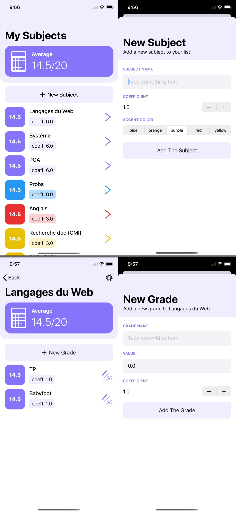

# MyGrades - iOS App

An app to keep track of school grades.
A tool that allows to compute the average in each unit and semester.

## Beta

A beta version is availible on TestFlight: [TestFlight Link](https://testflight.apple.com/join/bqQ6t58W)

## About

MyGrades is an app built with *Swift* and the framework *SwiftUI*. The app needs iOS13.0 or later.

## Screenshots

